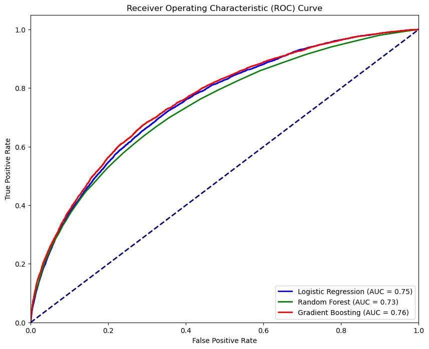
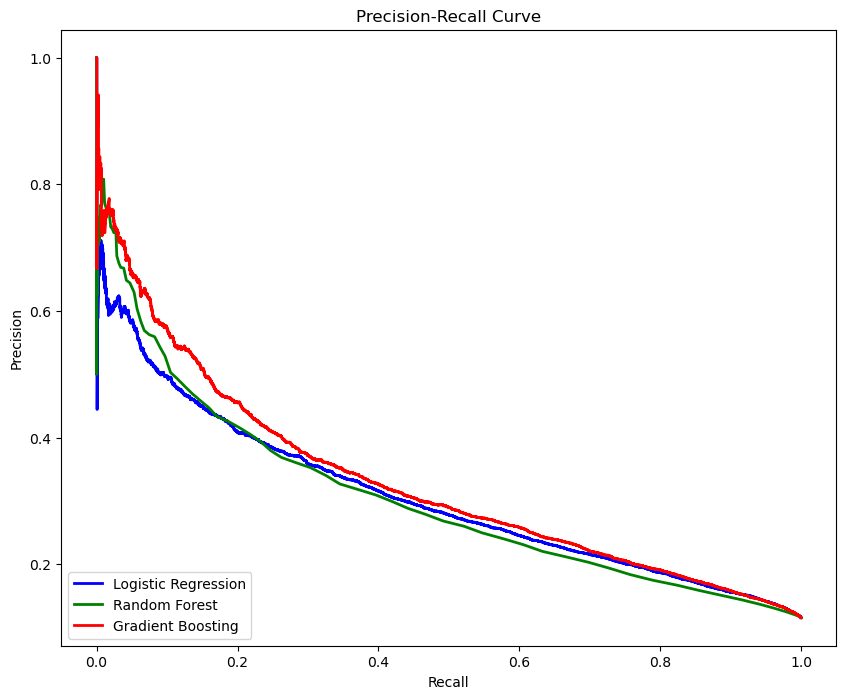
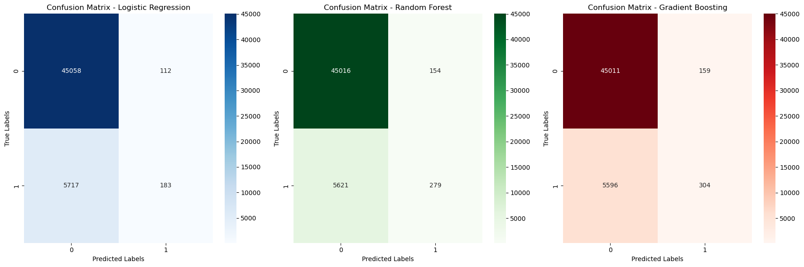

# Loan Default Predictive Analysis

## Overview
This project focuses on predicting loan defaults using a combination of data analysis, feature engineering, and machine learning techniques. The goal is to identify key factors influencing loan defaults and develop models that can accurately predict whether a loan will default.

## Table of Contents
1. [Dataset](#dataset)
2. [Project Structure](#project-structure)
3. [Installation](#installation)
4. [Usage](#usage)
5. [Model Performance](#model-performance)
6. [Visualizations](#visualizations)
7. [Contributing](#contributing)
8. [License](#license)

## Dataset
The dataset used in this project is sourced from the Loan Default Prediction Challenge on Coursera. It contains 255,347 rows and 18 columns, providing information on borrowers and their loan statuses. The dataset includes variables such as `Age`, `Income`, `LoanAmount`, `CreditScore`, `InterestRate`, and others.

- [Dataset Link](https://www.kaggle.com/datasets/nikhil1e9/loan-default)

### Key Features:
- **Borrower Characteristics**: Age, Income, CreditScore, ....
- **Loan Information**: LoanAmount, InterestRate, LoanTerm, ....
- **Loan Outcome**: Default status (target variable)

## Project Structure
The project is organized into several key components:

- `ETL_Dataset_Preprocessing.ipynb`: Notebook for data cleaning, preprocessing, and feature engineering. This includes handling missing values, encoding categorical variables, and creating new features such as `DTIRatio`.
- `Predictive_analysis_logistic_regression.ipynb`: Notebook focused on logistic regression for predictive modeling. It includes model training, evaluation, and interpretation of coefficients.
- `Predictive_analysis_ensemble.ipynb`: Notebook implementing ensemble models like Random Forest and Gradient Boosting. It compares the performance of different models using metrics such as accuracy, precision, F1 score, and AUC-ROC.

## Installation
To run this project, you need to have Python and the following libraries installed:

- `pandas`
- `numpy`
- `matplotlib`
- `seaborn`
- `scikit-learn`

You can install these dependencies using the following command:

```bash
pip install -r requirements.txt

```

## Notes

```bash
conda create -n loan_default_prediction python=3.11
conda activate loan_default_prediction
pip install -r requirements.txt
```
- The original dataset `Loan_default.csv` was preprocessed in `ETL_Dataset_Preprocessing.ipynb` and exported to a new file called `preprocessed_loan_data.csv`.
- `preprocessed_loan_data.csv` is used in the notebooks `Predictive_analysis_logistic_regression.ipynb` and `Predictive_analysis_ensemble.ipynb` for predictive analysis.

## Usage
1. Clone this repository to your local machine.
```bash 
git clone git remote add origin https://github.com/ayhameed/Loan_default_analysis.git
cd Loan-default-analysis
```
2. Open a terminal and run the following command to start the Jupyter Notebook:
```
jupyter notebook
```
3. Explore the notebooks
- Open `ETL_Dataset_Preprocessing.ipynb` to see the data cleaning and preprocessing steps.
- Open `Predictive_analysis_logistic_regression.ipynb` to analyze the logistic regression model.
- Open `Predictive_analysis_ensemble.ipynb` to compare the performance of ensemble models including Logistic Regression, Random Forest and Gradient Boosting.

## Model Performance 

The models were evaluated using the metrics below:

### Summary Table

| Model Name            | Accuracy | TP  | FP  | TN    | FN   | F1 Score |
|-----------------------|----------|-----|-----|-------|------|----------|
| Logistic Regression    | 0.885863 | 183 | 112 | 45058 | 5717 | 0.059080 |
| Random Forest          | 0.886763 | 276 | 159 | 45011 | 5624 | 0.087135 |
| Gradient Boosting      | 0.887312 | 304 | 159 | 45011 | 5596 | 0.095552 |

- **Accuracy**: Represents the percentage of correct predictions.
- **F1 Score**: Harmonic mean of precision and recall, especially useful for imbalanced datasets.


## Visualizations

The following plots were generated to assess model performance:

- ROC Curve: shows the trade-off between the true positive rate and false positive rate.


- Precision-Recall Curve: shows the relationship between precision and recall for different threshold values

.
- Confusion Matrix Heatmap: Provides a breakdown of true positives, false positives, true negatives, and false negatives.


These visualizations are important for understanding model strengths and weaknesses and are available in the respective notebooks.

## Summary 

### Strong Variables Leading to Loan Default

<table border="1">
    <thead>
        <tr>
            <th>Feature</th>
            <th>Coefficient</th>
            <th>Absolute Coefficient</th>
            <th>Impact</th>
        </tr>
    </thead>
    <tbody>
        <tr>
            <td>InterestRate</td>
            <td>0.449855</td>
            <td>0.449855</td>
            <td>High positive effect; higher interest rates increase the likelihood of default.</td>
        </tr>
        <tr>
            <td>Age</td>
            <td>-0.588019</td>
            <td>0.588019</td>
            <td>High negative effect; older individuals are less likely to default.</td>
        </tr>
        <tr>
            <td>Income</td>
            <td>-0.345758</td>
            <td>0.345758</td>
            <td>High negative effect; higher income decreases the likelihood of default.</td>
        </tr>
        <tr>
            <td>MonthsEmployed</td>
            <td>-0.332339</td>
            <td>0.332339</td>
            <td>High negative effect; more months employed decreases the likelihood of default.</td>
        </tr>
        <tr>
            <td>LoanAmount</td>
            <td>0.297019</td>
            <td>0.297019</td>
            <td>Positive effect; larger loan amounts increase the likelihood of default.</td>
        </tr>
    </tbody>
</table>

### Variables with Minimal Effect

<table border="1">
    <thead>
        <tr>
            <th>Feature</th>
            <th>Coefficient</th>
            <th>Absolute Coefficient</th>
            <th>Impact</th>
        </tr>
    </thead>
    <tbody>
        <tr>
            <td>EmploymentType</td>
            <td>0.147228</td>
            <td>0.147228</td>
            <td>Minimal positive effect.</td>
        </tr>
        <tr>
            <td>HasCoSigner</td>
            <td>-0.139216</td>
            <td>0.139216</td>
            <td>Minimal negative effect.</td>
        </tr>
        <tr>
            <td>HasDependents</td>
            <td>-0.120308</td>
            <td>0.120308</td>
            <td>Minimal negative effect.</td>
        </tr>
        <tr>
            <td>CreditScore</td>
            <td>-0.120074</td>
            <td>0.120074</td>
            <td>Minimal negative effect.</td>
        </tr>
        <tr>
            <td>NumCreditLines</td>
            <td>0.097799</td>
            <td>0.097799</td>
            <td>Minimal positive effect.</td>
        </tr>
    </tbody>
</table>


## Contributing
Contributions are welcome! If you have any improvements, feel free to submit a pull request or open an issue.

## License
This project is licensed under the MIT License. See the LICENSE file for more details.
